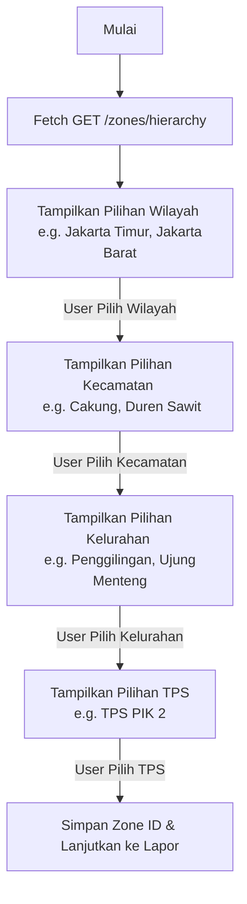

# 🤖 Panduan Integrasi WhatsApp Chatbot (Baileys.js) dengan Samling AI API

Panduan ini ditujukan bagi pengembang chatbot (Node.js + Baileys.js) untuk menghubungkan chatbot WhatsApp dengan API Backend **Samling AI**. Panduan ini mencakup tiga fitur utama:
1. **Navigasi Hirarki Wilayah TPS** (Menghindari input manual kecamatan).
2. **Lapor Sampah dengan Lampiran Gambar** (`multipart/form-data`).
3. **Cek Status Laporan berdasarkan ID Tiket**.

---

## 📌 Base URL API
* **GUNAKAN BASE URL INI! =>** `https://api-samling.naufalrafa.my.id/api/v1`

---

## 🗺️ Fitur 1: Navigasi Hirarki Wilayah & Pemilihan TPS

Fitur ini memungkinkan chatbot menampilkan pilihan wilayah administratif DKI Jakarta secara bertahap kepada warga tanpa memaksakan input manual (yang rentan typo).

### Spesifikasi Endpoint
* **Method & URL:** `GET /zones/hierarchy`
* **Auth:** Public / No Auth
* **Respon Sukses (`200 OK`):**
  ```json
  {
    "success": true,
    "message": "Zones hierarchy retrieved successfully",
    "data": {
      "provinsi": "DKI Jakarta",
      "wilayah": [
        {
          "name": "Jakarta Timur",
          "kecamatan": [
            {
              "name": "Cakung",
              "kelurahan": [
                {
                  "name": "Penggilingan",
                  "tps": [
                    {
                      "id": 1,
                      "name": "TPS PIK 2",
                      "jenis_tps": "Tps 3R",
                      "alamat": "PIK 2 pengiilingan",
                      "latitude": -6.2365936,
                      "longitude": 106.8985081,
                      "risk_status": "Normal"
                    }
                  ]
                }
              ]
            }
          ]
        }
      ]
    }
  }
  ```

### Alur Percakapan Chatbot


### Cara Parsing Dinamis di Node.js (State Management)
Simpan data JSON di dalam session/state bot agar hanya perlu menembak API sekali di awal sesi.

```javascript
let cachedHierarchy = null; 

async function getHierarchyData() {
  if (!cachedHierarchy) {
    const response = await fetch("http://localhost:8000/api/v1/zones/hierarchy");
    const json = await response.json();
    cachedHierarchy = json.data;
  }
  return cachedHierarchy;
}

// 1. Ambil list Wilayah (Langkah 1)
function getWilayahList(data) {
  return data.wilayah.map(w => w.name); // ["Jakarta Timur", "Jakarta Barat", ...]
}

// 2. Ambil list Kecamatan (Langkah 2)
function getKecamatanList(data, selectedWilayah) {
  const wilayah = data.wilayah.find(w => w.name === selectedWilayah);
  return wilayah ? wilayah.kecamatan.map(k => k.name) : [];
}

// 3. Ambil list Kelurahan (Langkah 3)
// selectedKecamatan didapat dari pilihan user di Langkah 2
function getKelurahanList(data, selectedWilayah, selectedKecamatan) {
  const wilayah = data.wilayah.find(w => w.name === selectedWilayah);
  if (!wilayah) return [];
  const kecamatan = wilayah.kecamatan.find(k => k.name === selectedKecamatan);
  return kecamatan ? kecamatan.kelurahan.map(kel => kel.name) : [];
}

// 4. Ambil list TPS (Langkah 4)
function getTpsList(data, selectedWilayah, selectedKecamatan, selectedKelurahan) {
  const wilayah = data.wilayah.find(w => w.name === selectedWilayah);
  if (!wilayah) return [];
  const kecamatan = wilayah.kecamatan.find(k => k.name === selectedKecamatan);
  if (!kecamatan) return [];
  const kelurahan = kecamatan.kelurahan.find(kel => kel.name === selectedKelurahan);
  return kelurahan ? kelurahan.tps : []; // [{ id, name, alamat, latitude, longitude }]
}
```

---

## 📢 Fitur 2: Lapor Sampah dengan Lampiran Foto

Warga melaporkan keluhan tumpukan sampah beserta koordinat TPS yang dipilih dan menyertakan foto bukti sampah secara opsional/wajib.

### Spesifikasi Endpoint
* **Method & URL:** `POST /citizen-reports`
* **Auth:** Public / No Auth
* **Content-Type:** `multipart/form-data`
* **Payload Fields:**
  * `whatsapp_number` (string, required): Nomor WA pelapor format internasional bersih (tanpa suffix `@s.whatsapp.net`).
  * `report_content` (string, required): Teks pengaduan.
  * `zone_id` (int/string, required): ID TPS terpilih.
  * `image` (binary file, optional): Berkas gambar (`image/jpeg`, `image/png`).
* **Respon Sukses (`201 Created`):**
  ```json
  {
    "success": true,
    "message": "Laporan aduan warga berhasil diterima.",
    "data": {
      "id": 15,
      "whatsapp_number": "6281234567890",
      "report_content": "Sampah plastik menumpuk",
      "zone_id": 1,
      "status": "Baru",
      "is_grouped": false,
      "image_path": "uploads/abcde123.webp",
      "created_at": "2026-07-12T19:53:22"
    }
  }
  ```

### Contoh Implementasi Baileys.js (Mengambil Gambar & Kirim Form-Data)

```javascript
const { downloadMediaMessage } = require('@whiskeysockets/baileys');
const FormData = require('form-data');
const fetch = require('node-fetch');

async function submitReport(msg, sock, selectedZoneId, reportText) {
  try {
    // 1. Sanitasi Nomor WhatsApp Pengirim (Menghapus JID Suffix Baileys)
    // Mengubah "6281234567890:2@s.whatsapp.net" menjadi "6281234567890"
    const rawSender = msg.key.participant || msg.key.remoteJid;
    const cleanNumber = rawSender.split('@')[0].split(':')[0];

    const form = new FormData();
    form.append('whatsapp_number', cleanNumber);
    form.append('report_content', reportText);
    form.append('zone_id', selectedZoneId.toString());

    // 2. Cek apakah ada file media gambar pada pesan masuk
    const messageType = Object.keys(msg.message)[0];
    if (messageType === 'imageMessage') {
      console.log("Mengunduh gambar dari WhatsApp...");
      const buffer = await downloadMediaMessage(
        msg,
        'buffer',
        {},
        { 
          logger: console,
          reuploadRequest: sock.updateMediaMessage
        }
      );

      // Lampirkan buffer ke form-data
      form.append('image', buffer, {
        filename: 'report_image.jpg',
        contentType: 'image/jpeg',
      });
    }

    // 3. Post ke API Samling
    const response = await fetch("http://localhost:8000/api/v1/citizen-reports", {
      method: 'POST',
      body: form,
      headers: form.getHeaders() // PENTING: biarkan library form-data mengatur boundaries-nya
    });

    const result = await response.json();
    
    if (result.success) {
      const ticketId = result.data.id;
      await sock.sendMessage(msg.key.remoteJid, { 
        text: `✅ *Laporan Diterima!*\n\nNomor Tiket Anda: *#${ticketId}*\nStatus: *Baru*\n\nTerima kasih, laporan Anda segera kami tindaklanjuti.`
      });
    } else {
      throw new Error(result.message || "Gagal menyimpan laporan.");
    }

  } catch (error) {
    console.error("Gagal melakukan pelaporan:", error);
    await sock.sendMessage(msg.key.remoteJid, { 
      text: "❌ Terjadi kesalahan sistem saat memproses laporan Anda." 
    });
  }
}
```

---

## 🔍 Fitur 3: Cek Status Laporan berdasarkan ID Tiket

Memungkinkan warga menanyakan status penanganan keluhan mereka secara mandiri menggunakan nomor tiket pengaduan yang mereka peroleh saat lapor.

### Spesifikasi Endpoint
* **Method & URL:** `GET /citizen-reports/{id}`
* **Auth:** Public / No Auth
* **Respon Sukses (`200 OK`):**
  ```json
  {
    "success": true,
    "message": "Detail laporan aduan warga berhasil diambil.",
    "data": {
      "id": 12,
      "status": "Sedang Ditangani",
      "report_content": "Ada tumpukan sampah plastik di depan pasar.",
      "created_at": "2026-07-12T19:53:22",
      "zone": {
        "name": "TPS PIK 2",
        "kelurahan": "Penggilingan",
        "kecamatan": "Cakung"
      }
    }
  }
  ```

### Contoh Implementasi Baileys.js (Mengambil Status & Formatting Chat)

```javascript
const STATUS_MAP = {
  "Baru": "🔴 Baru (Menunggu Antrean Armada)",
  "Sedang Ditangani": "🟡 Sedang Ditangani (Supir sedang menuju TPS)",
  "Selesai": "🟢 Selesai (Sampah telah diangkut & TPS bersih)"
};

async function checkStatus(msg, sock, ticketInput) {
  const chatId = msg.key.remoteJid;
  const ticketId = parseInt(ticketInput.trim(), 10);

  if (isNaN(ticketId)) {
    await sock.sendMessage(chatId, { text: "⚠️ Masukkan nomor tiket berupa angka saja. Contoh: *12*" });
    return;
  }

  try {
    const response = await fetch(`http://localhost:8000/api/v1/citizen-reports/${ticketId}`);
    
    if (response.status === 404) {
      await sock.sendMessage(chatId, { text: `🔍 *Tiket #${ticketId} tidak ditemukan.* Pastikan kembali nomor tiket Anda.` });
      return;
    }

    const result = await response.json();
    const report = result.data;
    const dateFormatted = new Date(report.created_at).toLocaleDateString('id-ID', {
      day: 'numeric', month: 'long', year: 'numeric', hour: '2-digit', minute: '2-digit'
    });

    const outputMessage = `📋 *STATUS LAPORAN ADUAN WARGA*
════════════════════════
🎫 *Nomor Tiket:* #${report.id}
📅 *Tanggal Lapor:* ${dateFormatted}
📌 *Lokasi TPS:* ${report.zone?.name || 'Tidak diketahui'}
📍 *Kelurahan/Kecamatan:* ${report.zone?.kelurahan || '-'}/${report.zone?.kecamatan || '-'}
💬 *Deskripsi Laporan:* "${report.report_content}"

📊 *Status Penanganan:* 
👉 *${STATUS_MAP[report.status] || report.status}*
════════════════════════`;

    await sock.sendMessage(chatId, { text: outputMessage });

  } catch (error) {
    console.error("Error cek status:", error);
    await sock.sendMessage(chatId, { text: "❌ Gagal memproses permintaan cek status Anda." });
  }
}
```

---

## 💡 Tips & Best Practices Integrasi

1. **JID Sanitization:** Selalu bersihkan JID yang didapat dari Baileys (`msg.key.remoteJid` atau `msg.key.participant`) menggunakan `.split('@')[0].split(':')[0]` untuk menjamin nomor bersih yang cocok dengan pola regex backend (`^62\d{9,13}$`).
2. **Form-Data Boundaries:** Jangan pernah menulis header `Content-Type: multipart/form-data` secara hardcode di Node.js saat mengirim gambar. Gunakan `form.getHeaders()` dari library `form-data` agar field boundaries terisi otomatis.
3. **Caching Hierarchy:** Data TPS tidak sering berubah. Fetch `/zones/hierarchy` sekali saat bot dijalankan (atau dijadwalkan ulang sehari sekali), simpan di memori untuk menghemat waktu respon bot.
