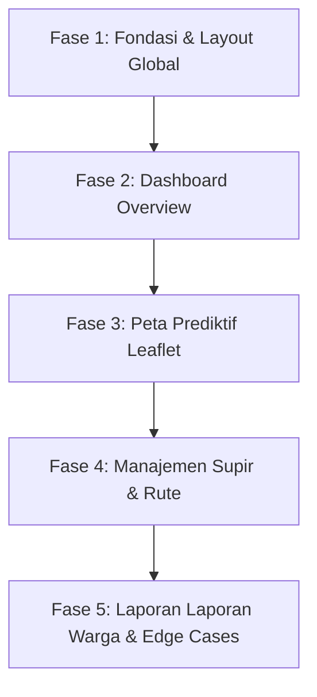

# 🗺️ Rencana Implementasi & Overhaul Frontend: Dashboard Admin Samling AI

Dokumen ini memuat cetak biru (*blueprint*) dan rencana strategi untuk merombak serta membangun modul **Dashboard Admin** pada aplikasi frontend Samling AI. Rencana ini mengacu pada panduan `DESIGN_SYSTEM_ADMIN_SAMLING.md` dan memanfaatkan teknologi React 19, Vite, Tailwind CSS v4, React Router v8, Chart.js, dan Leaflet.

---

## 🏗️ 1. Arsitektur Frontend & Tech Stack

Untuk memastikan aplikasi berjalan dengan performa tinggi (*high performance*), modular, dan mudah dikembangkan oleh tim (*scalable*), arsitektur frontend akan mengadopsi standar berikut:

*   **Framework**: **React 19** (terinstall) untuk manipulasi DOM dan state management yang responsif.
*   **Build Tool**: **Vite 8** (terinstall) untuk proses *hot reloading* dan bundling yang sangat cepat.
*   **Styling**: **Tailwind CSS v4** (terinstall via `@tailwindcss/vite`) sebagai repositori utility classes dan token warna semantik.
*   **Routing**: **React Router v8** (terinstall) menggunakan pola deklaratif untuk manajemen halaman dashboard.
*   **Visualisasi Peta**: **Leaflet** & **React Leaflet** untuk rendering peta geografis TPS secara interaktif.
*   **Visualisasi Grafik**: **Chart.js** & **React-Chartjs-2** untuk visualisasi proyeksi sampah 7 hari ke depan.

---

## 🎨 2. Strategi Token & Design System (Tailwind CSS v4)

Sebelum membuat komponen halaman, kita perlu mendefinisikan variabel global (Token Desain) di dalam file CSS utama (misalnya [frontend/src/index.css](file:///home/naufal/Documents/my-projects/samling-ai/frontend/src/index.css)) agar konsisten secara semantik:

*   **Warna Utama**:
    *   `primary` (Hijau Samling): `#10B981` (Emerald 500)
    *   `primary-light` (Highlight Filter): `#E6F4EA`
*   **Warna Risiko (Semantik)**:
    *   `risk-normal` (Rendah): `#22C55E` (Green 500)
    *   `risk-warning` (Sedang): `#F59E0B` (Amber 500)
    *   `risk-high` (Tinggi/Prioritas): `#EF4444` (Red 500)
    *   `risk-offline` (Sensor IoT Mati): `#94A3B8` (Slate 400)
*   **Tipografi**: Menggunakan font `@fontsource/dm-sans` (DM Sans) yang modern dan profesional.

---

## 📅 3. Tahapan Pengembangan (Milestones & Phases)

Strategi pengerjaan dibagi menjadi 5 fase terukur agar proses development terarah dan efisien:



### 🔴 Fase 1: Fondasi Proyek & Layout Global (Struktur Navigasi)
*   **Tujuan**: Membuat kerangka dasar aplikasi agar terstruktur dengan rapi.
*   **Tugas**:
    1. Konfigurasi router utama di `frontend/src/main.jsx` atau `frontend/src/App.jsx` menggunakan React Router v8.
    2. Membuat komponen **Sidebar Menu (Width: 260px)** yang berisi navigasi:
        *   📊 Overview
        *   🗺️ Peta Pemantauan (Predictive Map)
        *   🚚 Manajemen Rute & Driver (Fleet & Dispatch)
        *   💬 Laporan WhatsApp Warga (Citizen Reports)
    3. Membuat **Main Layout wrapper** yang responsif dan menangani transisi halaman yang mulus.

### 🟢 Fase 2: Halaman Overview (Dashboard Utama)
*   **Tujuan**: Menyajikan ringkasan visual berkecepatan tinggi (*above the fold*).
*   **Tugas**:
    1. **Contextual Alert Banner**: Komponen dinamis yang mendeteksi anomali cuaca atau event lokal yang memengaruhi volume sampah.
    2. **KPI Metric Cards**: Grid 3 kolom untuk menampilkan metrik utama (Jumlah Laporan, TPS Kritis, Persentase Kesiapan Armada Supir).
    3. **AI Surge Prediction Graph**: Integrasi **Chart.js** berupa *Line Chart* interaktif yang menampilkan proyeksi 7 hari ke depan lengkap dengan *custom tooltip* untuk menampilkan *AI Confidence Score*.
    4. **Global Date Filter**: Kontrol filter cepat berbasis tombol chip (Hari Ini, Besok, 7 Hari).

### 🔵 Fase 3: Halaman Peta Pemantauan (Predictive Map)
*   **Tujuan**: Visualisasi spasial real-time TPS di atas peta kota.
*   **Tugas**:
    1. Integrasi peta **Leaflet** dengan gaya peta minimalis (*light/dark map tiles*).
    2. Pembuatan **Interactive Map Nodes**: Marker pin lokasi TPS dengan sistem warna semantik risiko (Hijau, Kuning, Merah).
    3. Implementasi **Pulse Animation** (Animasi Berkedip) menggunakan CSS keyframes khusus untuk TPS dengan status *High Priority* (Merah).
    4. **Hybrid Light Indicator**: Ikon kecil pada marker untuk membedakan apakah data berasal dari Sensor IoT langsung atau estimasi Prediksi AI.
    5. **Smart Hover Tooltips**: Informasi melayang yang memuat kapasitas TPS, nama supir, dan respon driver terhadap WhatsApp.
    6. Fitur **Task Completion Overlay**: Pin lokasi berubah menjadi transparan (opacity 40%) disertai centang hijau jika pengangkutan sampah berhasil divalidasi.

### 🟡 Fase 4: Fleet & WhatsApp Dispatch (Manajemen Supir)
*   **Tujuan**: Pembagian rute kerja dari prediksi AI ke driver di lapangan melalui WhatsApp Chatbot.
*   **Tugas**:
    1. **Preview Jalur Rute**: Mini-map Leaflet yang memvisualisasikan jalur garis rekomendasi supir.
    2. **Driver Readiness Tracker**: Panel daftar supir di sebelah kanan dengan indikator warna status respon (Abu-abu: pending, Hijau: siap, Merah: kendala).
    3. **Send Route via WhatsApp CTA**: Tombol aksi untuk mengirim rute ke nomor supir melalui integrasi API WhatsApp Gateway (tombol akan dinonaktifkan setelah diklik untuk menghindari spam).
    4. **Reassignment Dropdown**: Tombol alokasi ulang rute secara instan jika supir utama berhalangan atau melaporkan kendala.

### 🟣 Fase 5: Pusat Laporan Warga & Penanganan Edge Cases
*   **Tujuan**: Pengelolaan laporan WhatsApp warga dan penanganan kondisi error/ketiadaan data.
*   **Tugas**:
    1. **Layout Kanban Board (3 Kolom)**: Laporan Baru, Sedang Ditangani, dan Selesai.
    2. **AI Duplicate Grouping**: Label khusus (*"+3 Laporan Serupa"*) untuk laporan yang berada dalam radius < 50 meter agar daftar laporan tidak menumpuk.
    3. **Image Lightbox**: Menampilkan modal foto tumpukan sampah resolusi penuh saat diklik.
    4. **Empty State & Exception Handling**:
        *   Desain visual maskot membersihkan jalanan saat tidak ada laporan warga.
        *   Tampilan node abu-abu putus-putus (`#94A3B8`) jika sensor IoT terputus dari jaringan.
        *   Floating warning toast kuning jika server AI mengalami kegagalan memproses prediksi.

---

## 🔗 4. Strategi Integrasi API dengan Backend FastAPI

Frontend akan berkomunikasi dengan backend FastAPI secara asinkron menggunakan client `fetch` atau library `axios` dengan pemetaan endpoint sebagai berikut:

| Fitur / Halaman | Endpoint Backend | Metode HTTP | Deskripsi Data |
| :--- | :--- | :--- | :--- |
| **Auth / Login** | `/login` | `POST` | Autentikasi Admin, menyimpan token. |
| **Overview & Map** | `/zones` | `GET` | Mengambil data wilayah TPS beserta koordinat dan `risk_status`. |
| **IoT Data** | `/sensor_data` | `GET` | Memperbarui level kapasitas TPS di peta real-time. |
| **AI Prediction** | `/volume_predictions` | `GET` | Mengambil estimasi volume dan `confidence_score` untuk Chart. |
| **Citizen Reports** | `/citizen_reports` | `GET`/`PUT` | Membaca list laporan warga dan mengubah status penanganan. |
| **Fleet & Drivers** | `/drivers` | `GET`/`PUT` | Memantau kesiapan supir dan memperbarui alokasi zona tugas. |

---

## 🚀 5. Struktur Folder Frontend yang Direkomendasikan

Untuk menjaga skalabilitas kode, struktur folder di dalam direktori `frontend/src/` akan diatur sebagai berikut:

```text
frontend/src/
├── assets/          # Logo, Ilustrasi Maskot (Empty State)
├── components/      # UI Kit Reusable (Button, Card, Modal, Sidebar)
│   ├── layout/      # Sidebar.jsx, Header.jsx, AdminLayout.jsx
│   └── ui/          # Badge.jsx, AlertBanner.jsx, Lightbox.jsx
├── pages/           # File Halaman Utama
│   ├── Overview.jsx
│   ├── PredictiveMap.jsx
│   ├── FleetDispatch.jsx
│   └── CitizenReports.jsx
├── services/        # Integrasi API (api.js untuk fetch data)
├── utils/           # Fungsi helper (formatter tanggal, parse koordinat)
├── App.jsx          # Konfigurasi Routing
├── index.css        # Setup Tailwind CSS v4 & custom animations
└── main.jsx         # React DOM Render
```
